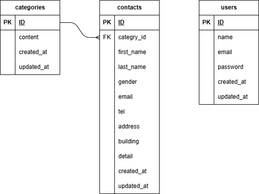

# fashionably-late
基礎学習ターム：確認テスト「お問い合わせフォーム」

## プロジェクト概要
Laravelを使用した、お問い合わせフォームおよび管理者用管理画面システムです。  
ユーザー側のお問い合わせ入力から、管理者側での検索・詳細確認・CSV出力までの一連の機能を実装しています。

## 使用技術 (Stack)
- **Framework**: Laravel 8.83.29
- **Language**: PHP 8.1
- **Database**: MySQL 8.0
- **Infrastructure**: Docker / Docker Compose

## 環境構築手順

### 1. リポジトリのクローン
```bash
git clone git@github.com:moimoi8/fashionably-late.git
cd fashionably-late
```

### 2. Dockerコンテナの起動
```bash
docker-compose up -d --build
```

### 3. アプリケーションのセットアップ

コンテナ内で以下のコマンドを実行し、動作環境を整えます。
```bash
# PHPコンテナ内に入る
docker-compose exec php bash

# 依存パッケージのインストール
composer install

# 環境設定ファイルの作成
cp .env.example .env

# アプリケーションキーの生成
php artisan key:generate

# データベースのマイグレーションおよびシーディング
# (お問い合わせ種類等の初期データと、テスト用ユーザーが作成されます)
php artisan migrate --seed
```
### 4. ブラウザでの動作確認
お問い合わせフォーム: http://localhost/

管理画面ログイン: http://localhost/login

管理画面ログイン情報
管理者としてログインする際は、以下の初期アカウントを利用してください。

メールアドレス: admin@example.com

パスワード: password （※Seederにより作成されます）

実装機能一覧
ユーザー側
お問い合わせ入力フォーム（バリデーション機能付）

入力内容確認画面

サンクスページ（完了画面）

管理者側
管理者登録・ログイン・ログアウト機能

お問い合わせ一覧表示（ページネーション付）

検索機能（名前、性別、お問い合わせ種類、日付での絞り込み）

詳細表示（モーダルウィンドウによる表示）

データ削除機能

検索結果のCSVエクスポート

## ER図
